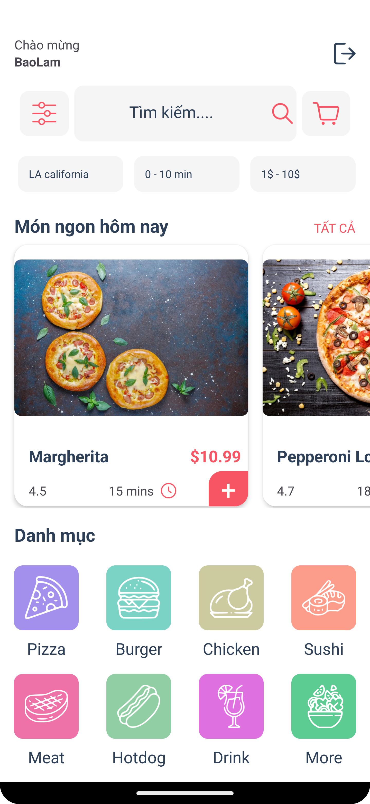
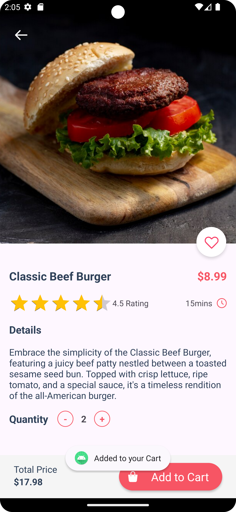
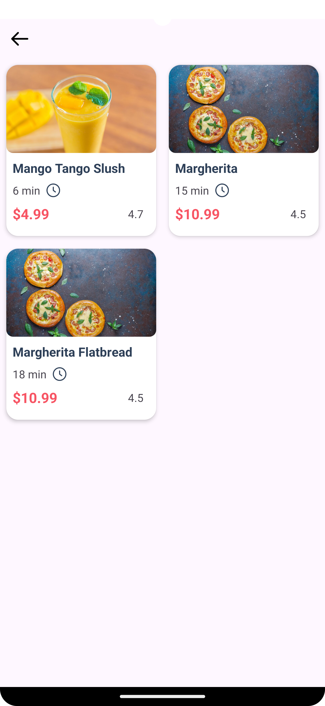
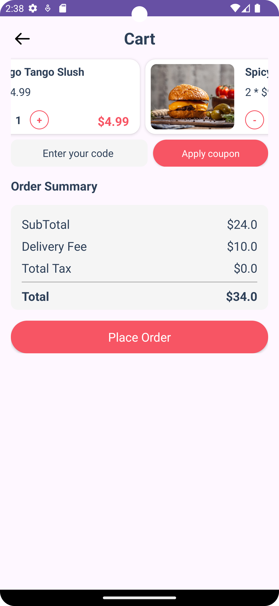

<h1 align="center">Order Food App</h1>

    Order Food App. This app was inspired by UILover.

---

## Home

    This is the Home layout. I have two RecyclerViews that display the bestFoodView and categoryView items.

---

## Food Details

    Each item has its own detailView that displays the name of the food, rating bar, price, and food description. 
    There are also buttons for increasing or decreasing the quantity and an "Add to Cart" button to add items to the cart.

Adding successfully:

---

## List Food

    The categoryRecyclerView displays a list of food items based on their category. 
    When an item is clicked, the <code>activity_list_food</code> appears.

---

## Search Bar

    There is a search section above that allows clients to search for the name of a food item using keywords.

---

## Cart

    Last but not least, I created a <code>CartActivity</code> that displays all the foods added before. 
    It also includes bill management. The "Place Order" button is currently non-functional as I am still learning how to implement it.

